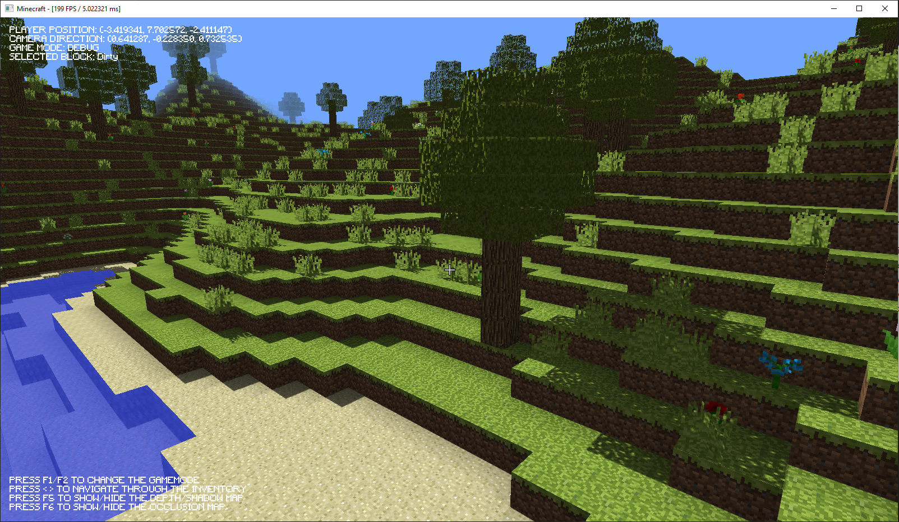
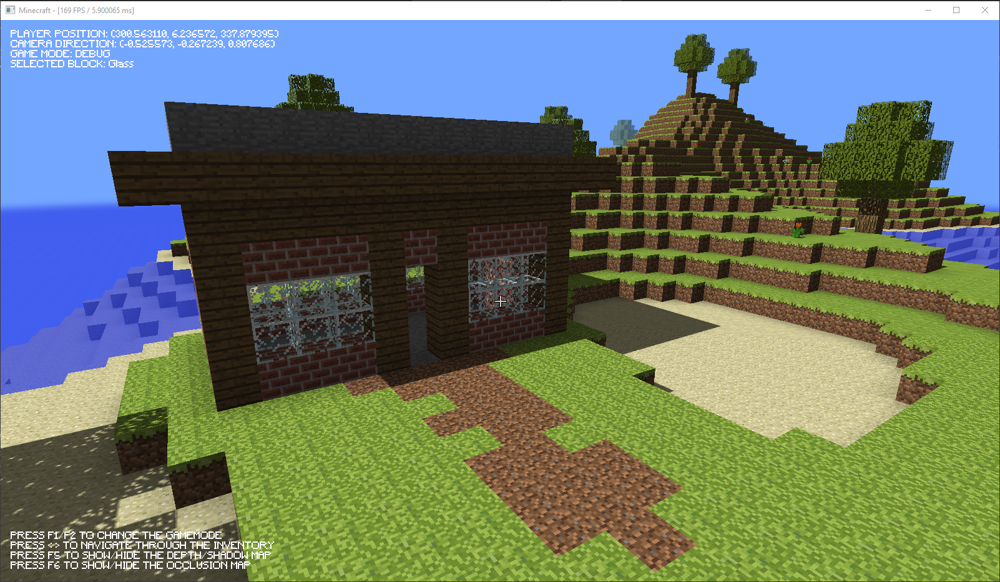

# ZCRAFT

A simple Minecraft clone created by Gustavo Zille, using C++ and OpenGL.

The project is being developed as a way to study some computer graphics and game programming techniques.

## Features

- Procedural World Generation;
  - Terrain Generation: Using Perlin Noise to create a Height Map;
  - Flora Generation: Trees, Leaves and Flowers.
- Optimized Mesh Building: Sampling only the visible faces to compose the generated chunk mesh;
- Translucent Blocks;
- Lighting: Using the Blinn-Phong lighting model (BPLM) to create a directional light;
- Shadows: Using a Shadow Map to store the depth of the fragments on the light view perspective;
- Ambient Occlusion: Simulating Ambient Occlusion (AO) with "corner shadows";
- Fog: Applying an exponential fog to hide the chunks procedural generation;
- Collisions;
  - AABB x AABB: Between the player and the solid blocks of the world;
  - AABB x Ray: Used when the player wants to Insert/Remove a block on/from the world.
- Physically Movement: Applying concepts like velocity, gravity and friction to the player's movement system;
- Basic Inventory System.

## Gallery

